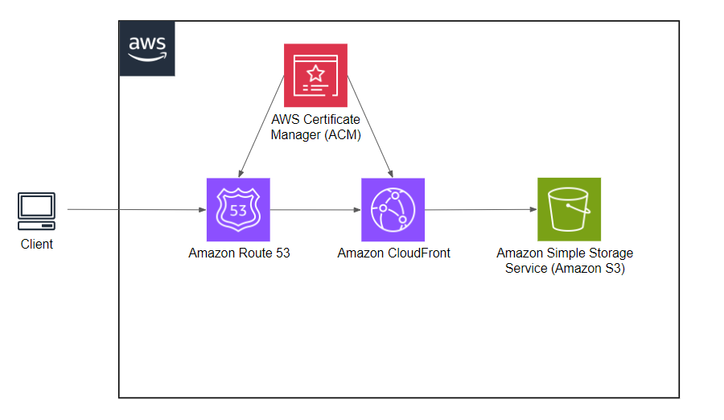

# Advanced Notes + AWS

AdvancedNotes an intuitive notes application built using TypeScript and ReactJS, powered by Vite for blazing-fast performance.

## Architectural Diagram

## Technologies Used:

- **TypeScript**: Ensures type safety and cleaner codebase.
- **ReactJS**: Provides a dynamic and interactive user interface.
- **Vite**: Lightning-fast development and production builds.
- **Amazon Web Services**: Cloud Service Provider.

## Markdown Support:

AdvancedNotes supports Markdown, allowing you to:

- Format text with ease using Markdown syntax.
- Create headings, lists, code blocks, and more.

## Getting Started:

To run the app locally, follow these steps:

1.  Clone the repository: `https://github.com/HUZ41FA/AdvancedNotes.git`
2.  Swith directory `cd app`
3.  Install dependencies: `npm install`
4.  Start the development server: `npm run dev`
